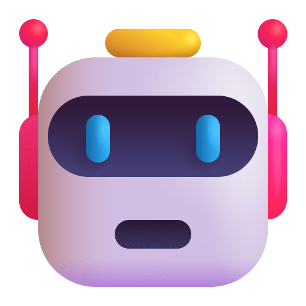

<h1 align="center"> Plataforma Multi Agente LangChain</h1>

 

## Demonstração da plataforma

https://user-images.githubusercontent.com/MultiAgentPlatform/vídeos/Multi_Agent_Platform_Demo.mp4

## Links

- Aplicação no Streamlit - [App Folder](https://github.com/lizmarques/Virtual_Assistant_Project/tree/master/VoiceBotProject)

## Objetivo

O principal objetivo deste projeto foi ganhar familiaridade com as APIs de Speech Recognition e Text-to-Speech, além de desenvolver uma aplicação que funcionasse corretamente baseada em comandos de voz. Nesta primeira versão, a assistente virtual conta com 5 funcionalidades:
- Agenda do Dia
- Notícias
- Bloco de Notas por Voz
- Pesquisa no Google
- Abrir o Microsoft Teams
- Extra: Apresentação da Ártemis (nome dado para assistente virtual)

 ## Próximos Passos
- Permitir o upload de arquivos via Google Drive
